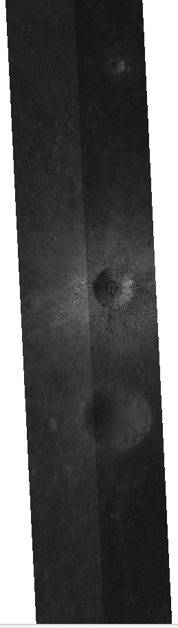
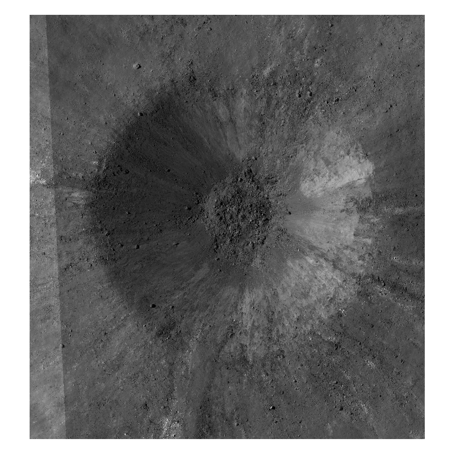
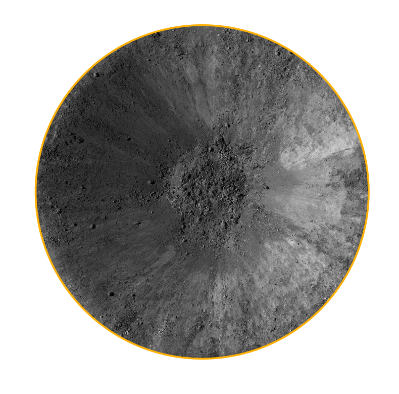
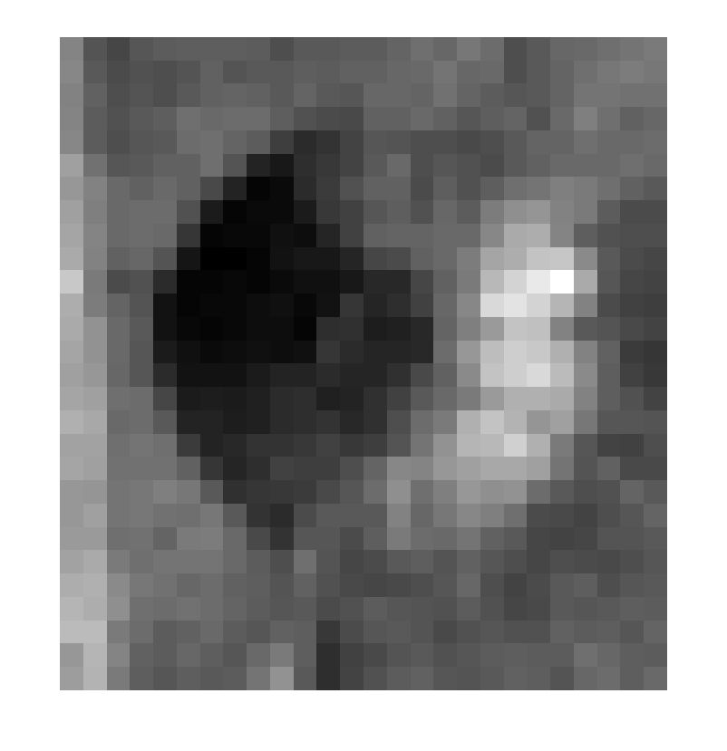

## Getting Started with rastertools

---

This document provides an introduction of rastertools. A jupyter-notebook file with the same code is also provided here (can be run, in contrary to this file). 

## Functionalities

+ functions to manipulate rasters, e.g., read, save, clip and tile rasters (`./raster.py`) 
+ extract metadata from raster (`./metadata.py`) 
+ practical tools for converting between grayscale and rgb(a) or coordinates related conversion (`./convert.py`) 
+ Include basic coordinate systems for the Moon and Mars (`./crs.py`) 

## Import of modules

```python
import sys
sys.path.append(<path-to-rastertools-library>)

import geopandas as gpd
import numpy as np
import rasterio as rio

from pathlib import Path
from affine import Affine

import rastertools.raster as raster
import rastertools.metadata as raster_metadata
import rastertools.crs as raster_crs
import rastertools.convert as raster_convert

"""
Note: rasterio expect (bands, rows, columns). whereas image processing software like scikit-image, pillow and matplotlib expect (rows, columns, bands). See https://rasterio.readthedocs.io/en/stable/topics/image_processing.html for more details. reshape_as_raster and reshape_as_image from rasterio.plot can be used to change between one and the other (or numpy can be used to swap axes). 
"""
```

## Getting Prepared 

*(working directory, download of original raster)*

Let's assume that you work on a Linux or UNIX machine. If this is not the case, I would advice you to install [Git for Windows](https://gitforwindows.org/) on your Windows computer. 

Let's save all of the future beautiful outputs of this tutorial in the temporary directory of your home folder. 

```python
home_p = Path.home()
work_dir= home_p / "tmp" / "rastertools"
raster_dir = (work_dir / "resources" / "raster")
shp_dir = (work_dir / "resources" / "shp")

# Let's define the working directories
work_dir.mkdir(parents=True, exist_ok=True)
raster_dir.mkdir(parents=True, exist_ok=True) 
shp_dir.mkdir(parents=True, exist_ok=True) 
```

And we can download the original raster and two shapefiles that we will use for this tutorial from my GoogleDrive. I am using the `gdown` library to download the GDrive files. Let's install it quickly within Python. 

```python
!pip install gdown
import gdown
```

We can now download the raster and shapefiles.

```python
url_raster = "https://drive.google.com/uc?id=115Ww5kouD7BO1qDzfdp1MGRuqqVCEoZc"
url_shapefiles= "https://drive.google.com/uc?id=1ln9FXZNEniuJ2y1KLkH8sn9LlVAUTH3M"
gdown.download(url_raster, (raster_dir / "M1221383405.tif").as_posix(), quiet=True)
gdown.download(url_shapefiles, (shp_dir / "shapefiles.zip").as_posix(), quiet=True)
# only work for Linux or UNIX machine (for Windows user, you can unzip the folder manually)
!unzip ~/tmp/rastertools/resources/shp/shapefiles.zip -d ~/tmp/rastertools/resources/shp/ 
```

Ok, we should be all set now! 

The raster is an image of the surface of the Moon, and is actually a mosaic of two Lunar Reconnaissance Orbiter (LRO) Narrow Angle Camera (NAC) images: M1221383405LE (https://wms.lroc.asu.edu/lroc/view_lroc/LRO-L-LROC-2-EDR-V1.0/M1221383405LE) and M1221383405RE (https://wms.lroc.asu.edu/lroc/view_lroc/LRO-L-LROC-2-EDR-V1.0/M1221383405RE). 

### Reading a raster

```python
r = raster_dir / "M1221383405.tif"
```


In order to read a raster, you can use the `read_raster` function:

```python
array = raster.read_raster(r) # to read the whole raster with all bands
```

(*raster in QGIS below*)



But you can include options if needed, such as selecting only the `bands` you are interested in:

```python
array = raster.read(r, bands=[1,2,3]) # bands starting from 1, in our case, the example raster has only one band...
array = raster.read(r, bands=[1]) 
```

You can also choose with the `as_image` flag if you want to have your array loaded with the rasterio (bands, rows, columns) or the image format (rows, columns, bands) . 

```python
# image format
array = raster.read(r, bands=[1], as_image=True) 
array.shape
(55680, 12816, 1)

# rasterio format 
array = raster.read(r, bands=[1], as_image=False) 
array.shape
(1, 55680, 12816)
```

If you don't want to load the whole raster, you can specify the bounding box of a portion of the image, and only the data within this portion will be loaded. Let's say you are only interested in the area around the very fresh impact crater in the middle of the original raster, and we have a polygon shapefile that constrain the boundary. 

```python
poly = shp_dir / "rectangular_ROI.shp"
gdf_poly = gpd.read_file(poly) # load a rectangular box covering the fresh impact crater in the middle of the image
bounds_poly = list(gdf_poly.bounds.values[0])
array = raster.read(r, bands=[1], bbox=bounds_poly, as_image=True) 
array.shape
(4500, 4194, 1)
```

If you want to save it as a new raster to avoid the use of the large original raster, which may slow down your computer, you can "clip" your raster. In order to save the new raster, the metadata (see Metadata section at the bottom of this file) of the new raster need to be created. We can use:

```python
original_raster_profile = raster_metadata.get_profile(r)
new_raster_profile = original_raster_profile.copy() 
```

The width, height and transform metadata need to be updated.

```python
new_raster_profile["transform"]
Affine(0.6339945614856195, 0.0, 10559291.7031,0.0, -0.6339945671695403, -428407.4778)
```

See https://en.wikipedia.org/wiki/Affine_transformation for more info about Affine transformation or write `Affine?`. But long story short, you need to specify the following: 

```python
raster_resolution = raster_metadata.get_resolution(r)[0]
# Affine(raster_resolution, 0.0, xmin, -raster_resolution, ymax) # xmin, ymax corresponds to the top left corner of the image
new_transform = Affine(raster_resolution, 0.0, bounds_poly[0], 0.0, -raster_resolution, bounds_poly[3])
```

Let's update the metadata:

```python
new_raster_profile.update({
         "width": array.shape[1],
         "height": array.shape[0],
         "transform": new_transform})
```

### Save the new raster

```python
out_raster = raster_dir / (r.stem + "_bbox_clip1.tif")
raster.save(out_raster, array, new_raster_profile, is_image=True)
```

(*new raster in QGIS*) 



NB! Using this workflow, was only for tutorial purpose as it introduces the user to basic functions such as `read_raster` and `save_raster` and the use of metadata-related functions. This pipeline actually introduce some shifts between the original and the new raster because of the coordinate of the top left extent of the polygon shapefile do not fall on the top left edge of a pixel (it can be fixed, but I am not covering that in the tutorial). 

### Clipping

For a correct behavior for the clipping of rasters, please use `clip_from_bbox` or `clip_from_polygon`:

``` python
out_raster = raster_dir / (r.stem + "_bbox_clip2.tif")
raster.clip_from_bbox(r, bounds_poly, out_raster)
```

With a polygon (if we want a different shape than a rectangular bounding box, for example a circle): 

```python
in_polygon = shp_dir / "crater_ROI.shp"
out_raster = raster_dir / (r.stem + "_crater_clip.tif")
raster.clip_from_polygon(r, in_polygon, out_raster)
```



### Reprojection (and crs.py)

(NB: Currently not working.)

```python
import rastertools.crs as raster_crs
```

Let' say we want to project our raster into a Mollweide projection.

```python
dst_crs = raster_crs.mollweide_proj(1737400, 1737400) # need to specify the minor and major axes for the Mollweide projection
out_raster = raster_dir / (r.stem + "_mollweide-projection.tif")
raster.projection(r, dst_crs, out_raster)
```

### Resampling

```python
out_resolution = 100.0 # meters
out_raster = raster_dir / (r.stem + "_100m-resolution.tif")
raster.resample(r, out_resolution, out_raster)
```



### Tiling

In most situations, the satellite images have shape much larger than can be input into deep learning algorithms. A way around this problem is to tile the large satellite images into smaller patches. The `raster.graticule` and  `raster.tile` functions allow you to simply do that with 2-3 lines of code.  Image tiles created with `raster.tile` are saved both as `tif` and `png` files. 

`raster.graticule` creates a polygon shapefile of all the image patches (`.shp`) and a pickle file (`.pkl`), which contains a number of information (`transform, bounds, file_name, and more...`) that can be used for the actual tiling of the original raster.

```python
__ = raster.graticule(in_raster, 512, 512, Path("/home/nilscp/tmp/raster-tmp/graticule-small.shp"), stride=(0, 0))
in_pkl = Path('/home/nilscp/tmp/raster-tmp/graticule-small.pkl')
raster.tile(in_raster, in_pkl, 512, 512)
```

### Extract footprint and true footprint

In some situations, you have to deal with multiple overlapping images. If you are interested in computing for example the intersection of two images, it can be handy to work with footprints (i.e., the extent of the raster).

```python
raster.footprint(in_raster, '/home/nilscp/tmp/raster-tmp/shp-footprint.shp')
```


### Polygonize


## convert.py


## metadata.py

```python
## if you want to extract all of the metadata of a raster 
raster_metadata.get_profile(r)
```

You should get a dictionary as output with all of the metadata:

```python
{'driver': 'GTiff', 
 'dtype': 'uint8', 
 'nodata': 0.0, 
 'width': 12816, 
 'height': 55680, 
 'count': 1, 'crs': 
 CRS.from_wkt('PROJCS["EQUIRECTANGULAR MOON",GEOGCS["GCS_MOON",DATUM["D_MOON",SPHEROID["MOON_localRadius",1737400,0]],PRIMEM["Reference_Meridian",0],UNIT["degree",0.0174532925199433,AUTHORITY["EPSG","9122"]]],PROJECTION["Equirectangular"],PARAMETER["standard_parallel_1",-14.59],PARAMETER["central_meridian",-10.48],PARAMETER["false_easting",0],PARAMETER["false_northing",0],UNIT["metre",1,AUTHORITY["EPSG","9001"]],AXIS["Easting",EAST],AXIS["Northing",NORTH]]'), 
 'transform': Affine(0.6339945614856195, 0.0, 10559291.7031, 0.0, -0.6339945671695403, -428407.4778), 
 'tiled': False, 'interleave': 'band'}
```

Or you can extract directly specific metadata of interest with the functions `get_raster_crs` , `get_raster_resolution`, `get_raster_types`, `get_raster_height` and so forth... (I let you have a look at `metadata.py`) For example, if you want to quickly get the raster resolution. 

```python
raster_metadata.get_raster_resolution(r)
```

Be careful as it returns the resolution along the x- and y-axes 

```python
(0.6339945614856195, 0.6339945671695403)
```


